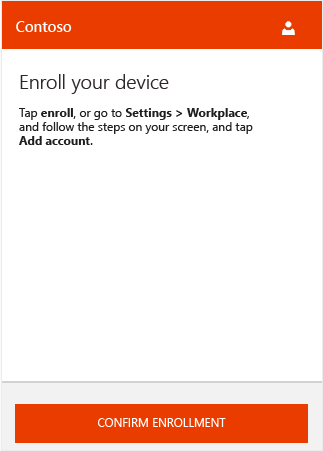
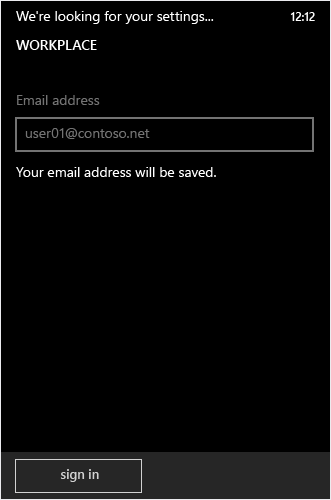
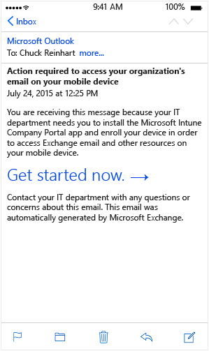
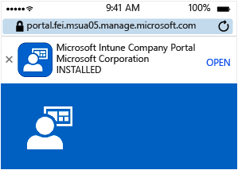
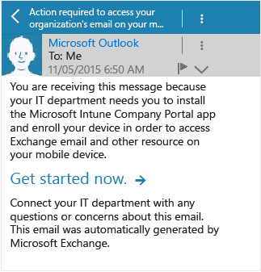
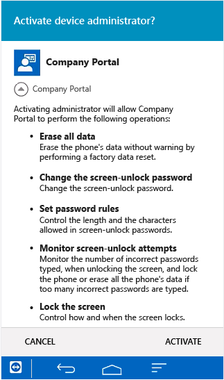

# End-user experience of conditional access
This topic describes the end-user experience after conditional access is enabled and an end user tries to access email on their mobile device.

> [!TIP]
> Get a downloadable copy of this entire topic at the [TechNet Gallery](https://gallery.technet.microsoft.com/Deploying-Enterprise-16499404).

## Windows Phone
> [!NOTE]
> The enrollment process and the screens the user sees will be slightly different depending on the version of OS running on the end-user device.

1.  If a user is already enrolled in Intune and is compliant, they will see no difference on Windows devices; they will continue to get access to email. Users who have not yet enrolled in Intune will receive a quarantine email similar to this sample:

    

    The user clicks **Get started now** to begin enrolling their device.

2.  On the Company Access Setup screen, the user clicks **Begin** to start setting up their device and checking whether it is compliant.

    

3.  On the Enroll Your Device screen, the user clicks **Confirm Enrollment** to start enrolling their device.

    

    During enrollment, the Mobile Device Management profile is installed to allow you, the IT administrator, to remotely manage the device. The user might be prompted to accept a certificate authorizing Workplace Join.

    

4.  The user signs in using their email address they use with Office. After they are signed in, they might need to click **Confirm Enrollment** once more to continue enrolling their device.

    

    The device is checked to verify that it is enrolled.

    

5.  The user then completes the enrollment process by selecting their device and clicking **Select**. If their device is not displayed, they can select **I don’t see my device listed** to try again.

    

    The device is checked to verify that it is complaint with company policies.

    

6.  If there is a compliance issue, the user is prompted to resolve the issue (such as creating a valid password) and to then click **Check Compliance** to continue.

    

    After compliance is verified, the user sees that enrollment is being activated.

    

7.  Enrollment is activated and the user clicks **Continue** to complete the process. The user then clicks **Done** to exit setup.

    

    After the user is enrolled and compliance is verified, email access should become available within a few minutes.

If the user follows those steps to enroll and become compliant and still cannot access their email on their mobile device, they can follow these additional steps to try and fix the issue:

-   First, verify that their device is enrolled. If not, the user follows the steps above.

-   Verify that the device is compliant by clicking **Check Compliance**. If a compliance error is identified, the user can follow the instructions specific to their mobile device about how to resolve it, such as resetting their password.

-   Call the help desk.

### If a device becomes noncompliant
Every 8 hours by default, devices are checked to ensure that they are still compliant. If a device that was previously compliant is later deemed to be noncompliant (for example, a compliance policy was added or changed), the user can follow these steps to get their device back in compliance:

1.  The user receives notification in email or on their device that the device is noncompliant. At this time, the device is quarantined in Exchange.

2.  If the user tries to access email, they are redirected back to the Company Access Setup screen from the Intune Company portal where it shows that they are out of compliance.

    

3.  The user clicks **Continue** and is shown the compliance issue that is preventing them from accessing email.

4.  After they have fixed the issue, they click **Check Compliance** to verify that the problem is resolved.

5.  If the issue is fixed, the user clicks **Continue** to complete the process. Email access should become available again within a few minutes.

## iOS
> [!NOTE]
> The enrollment process and the screens the user sees will be slightly different depending on the version of OS running on the end-user device.

1.  If a user is already enrolled in Intune and is compliant, they will see no difference on iOS devices; they will continue to get access to email. If the user is not yet enrolled, they will see a quarantine message similar to this when they launch their mail app:

    

    The user clicks **Get started now** to begin enrolling their device.

2.  The user is prompted to install the Intune Company Portal app from the respective app store.

    

    After it installs, the user opens the app and signs in using their company credentials.

3.  On the Company Access Setup screen, the user clicks **Begin** to start setting up their device and checking whether it is compliant.

    

4.  On the Device Enrollment screen, the user clicks **Enroll** to start enrolling their device.

    

    During enrollment, the Mobile Device Management profile is installed to allow you, the IT administrator, to remotely manage the device. The user enters their password if prompted.

5.  On the Company Access Setup screen, the user clicks **Continue** to start checking compliance on the device.

    

    If there is a compliance issue, the user is prompted to resolve the issue (such as by creating a valid password) and to then click **Check Compliance** to continue.

    

6.  After the device is fully compliant, the user clicks **Continue** to proceed.

    

    After the user is enrolled and compliance is verified, email access should become available within a few minutes.

If the user follows those steps to enroll and become compliant and still cannot access their email on their mobile device, they can follow these additional steps to try and fix the issue:

-   First, verify that their device is enrolled. If not, the user follows the steps above.

-   Verify that the device is compliant by clicking **Check Compliance**. If a compliance error is identified, the user can follow the instructions specific to their mobile device about how to resolve it, such as resetting their password.

-   Call the help desk.

### If a device becomes noncompliant
Every 8 hours by default, devices are checked to ensure that they are still compliant. If a device that was previously compliant is later deemed to be noncompliant (for example, a compliance policy was added or changed), the user can follow these steps to get their device back in compliance:

1.  The user receives notification in email or on their device that the device is noncompliant. At this time, the device is quarantined in Exchange.

2.  If the user tries to access email, they are redirected back to the Company Access Setup screen from the Intune Company portal where it shows that they are out of compliance.

    

3.  The user clicks **Continue** and is shown the compliance issue that is preventing them from accessing email.

    

4.  After they have fixed the issue, they click **Check Compliance** to verify that the problem is resolved.

5.  If the issue is fixed, the user clicks **Continue** to complete the process.

    

    Email access should become available again within a few minutes.

## Android
> [!NOTE]
> The enrollment process and the screens the user sees will be slightly different depending on the version of OS running on the end-user device.

1.  When they try to access email, the user first receives a quarantine email similar to this sample:

    

    The user clicks **Get started now** to begin enrolling their device.

    > [!NOTE]
    > If a user has not set a default browser for their device, they will be prompted during device enrollment and during enrollment activation to allow a link to open a browser window. When prompted, they must select the same browser each time or the enrollment process will fail.

2.  The user is prompted to install the Intune Company Portal app from the respective app store.

    

    After it installs, the user opens the app and signs in using their company credentials.

3.  On the Company Access Setup screen, the user clicks **Begin** to start setting up their device and checking whether it is compliant.

    

4.  On the Device Enrollment screen, the user clicks **Enroll** to start enrolling their device.

    

5.  Users must activate the device administrator by clicking **Activate** when prompted or the device enrollment procedure will cancel.

    

    Device enrollment begins. Depending on the device, a certificate installation prompt or a Samsung KNOX Privacy Policy prompt might appear during enrollment. These are necessary to allow you, the IT administrator, to remotely manage the device. The device is enrolled to Intune and establishes a device identity with Azure Active Directory.

    

6.  After enrollment is completed successfully, the user clicks **Continue** to start checking compliance on the device.

    

    If there is a compliance issue, the user is prompted to resolve the issue (such as creating a valid password) and to then click **Check Compliance** to continue.

    

7.  After the device is fully compliant, the user clicks **Continue** to initiate enrollment activation. This will connect the AAD device identity with the EAS ID provided by Exchange.

    > [!NOTE]
    > On Android, the default browser will appear for a few seconds during enrollment activation. If the user has not already selected a default browser, they are prompted to choose a browser. While completing Company Access Setup, the same browser must be selected by the user whenever prompted.

    

8.  Enrollment activation will complete and the user clicks **Done** to exit the enrollment and compliance verification process.

    

    After the user is enrolled and compliance is verified, email access should become available within a few minutes.

If the user follows those steps to enroll and become compliant and still cannot access their email on their mobile device, they can follow these additional steps to try and fix the issue:

1.  First, verify that their device is enrolled. If not, the user follows the steps above.

2.  Verify that the device is compliant by clicking **Check Compliance**. If a compliance error is identified, the user can follow the instructions specific to their mobile device about how to resolve it, such as resetting their password.

3.  Call the help desk.

### If a device becomes noncompliant
Every 8 hours by default, devices are checked to ensure that they are still compliant. If a device that was previously compliant is later deemed to be noncompliant (for example, a compliance policy was added or changed), the user can follow these steps to get their device back in compliance:

1.  The user receives notification in email or on their device that the device is noncompliant. At this time, the device is quarantined in Exchange.

2.  When the user tries to access email, they see a quarantine email informing them that compliance issues must be fixed before they can get access. When the user clicks on the hyperlink in the quarantine email, it redirects them to the Company Access Setup screen in the Intune Company portal (via default browser and Google Play) where it shows that the device is not compliant.

    

3.  The user clicks **Continue** and is shown the compliance issue that is preventing them from accessing email.

    

4.  After they have fixed the issue, they click **Check Compliance** to verify that the problem is resolved.

5.  If the issue is fixed, the user clicks **Continue** to complete the process. Email access should become available again within a few minutes.

## See Also
[Learn how to deploy a solution for protecting company email and documents](../Topic/Learn_how_to_deploy_a_solution_for_protecting_company_email_and_documents.md)
[Use conditional access with Intune and Configuration Manager](../Topic/Use_conditional_access_with_Intune_and_Configuration_Manager.md)

